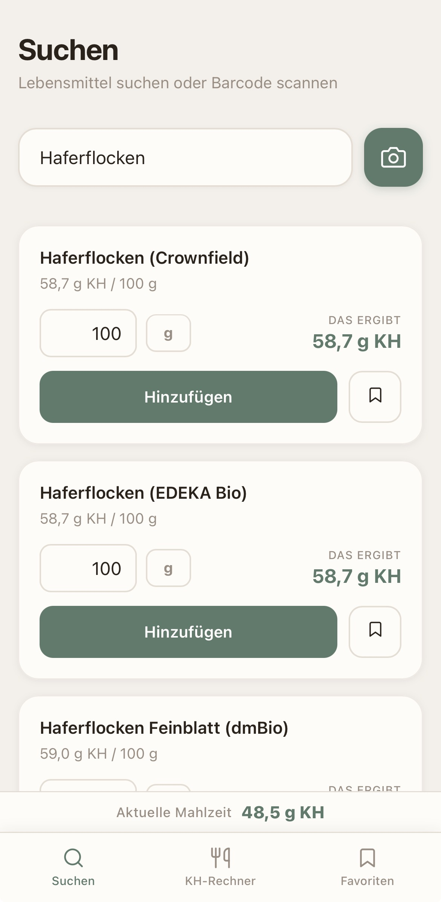
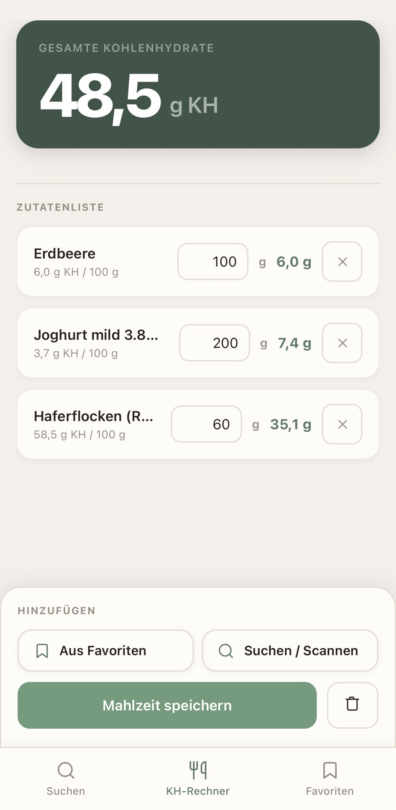
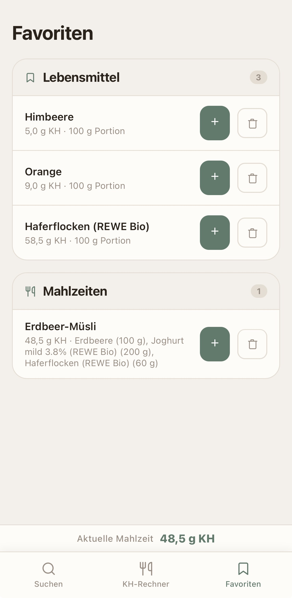
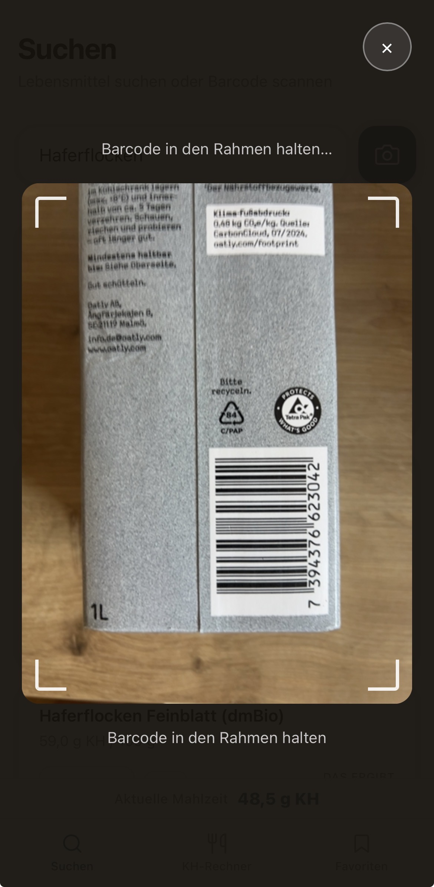

# OmniCalc

A carbohydrate calculator for people with diabetes — designed to calculate meal carbs for accurate Omnipod insulin dosing.

**[Live Demo →](https://some2sum.github.io/OmniCalc/)**

## What it does

- Search for foods by name (German food database BLS + Open Food Facts)
- Scan barcodes with your phone camera
- Set portion sizes in grams or milliliters
- See the total carbohydrates of your meal instantly
- Save favorite foods and complete meals for quick reuse

## How to use

1. Open the app on your phone
2. Search for a food or scan its barcode
3. Set the amount → tap "Hinzufügen" (Add)
4. Repeat for each item in your meal
5. Read the total KH (carbohydrate) value at the top

## Screenshots

<table>
  <tr>
    <td></td>
    <td></td>
    <td></td>
    <td></td>
  </tr>
  <tr>
    <td align="center">Search</td>
    <td align="center">KH Calculator</td>
    <td align="center">Favorites</td>
    <td align="center">Barcode Scanner</td>
  </tr>
</table>

## Tech

- Single `index.html` file — no framework, no build step
- Data stored locally in the browser (localStorage)
- APIs: [BLS](https://blsdb.de) · [Open Food Facts](https://world.openfoodfacts.org)
- Barcode scanning via [ZXing](https://github.com/zxing-js/library)
